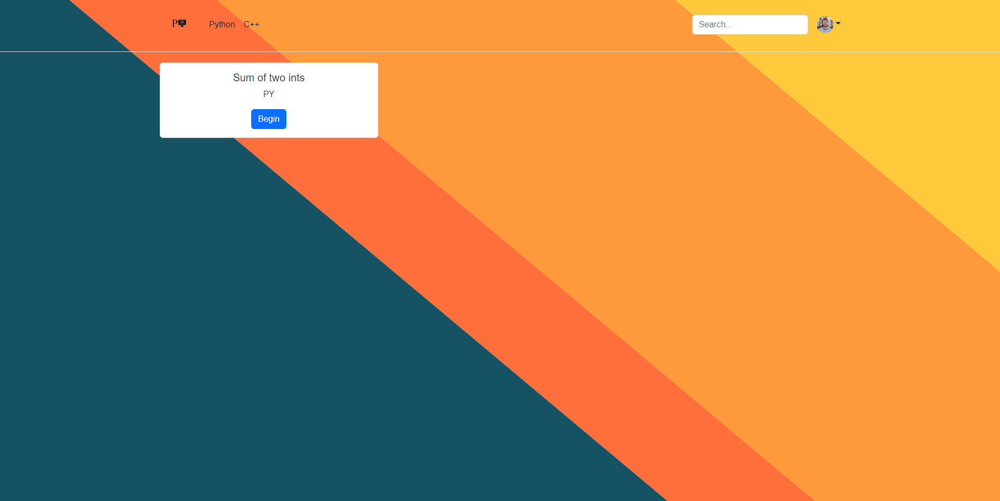
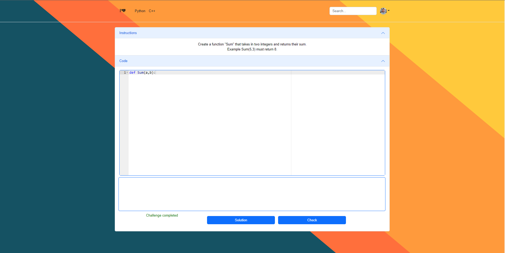
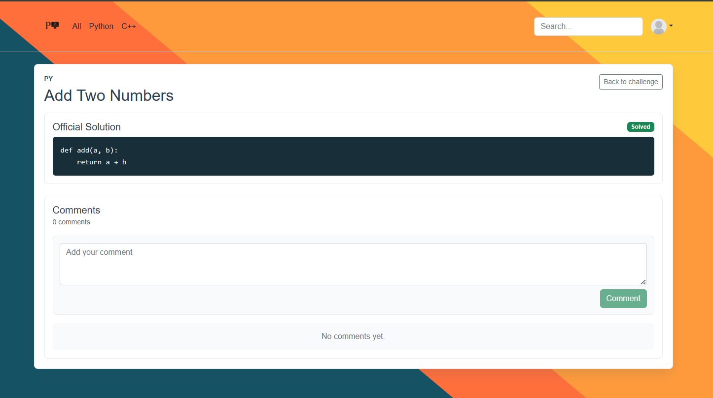
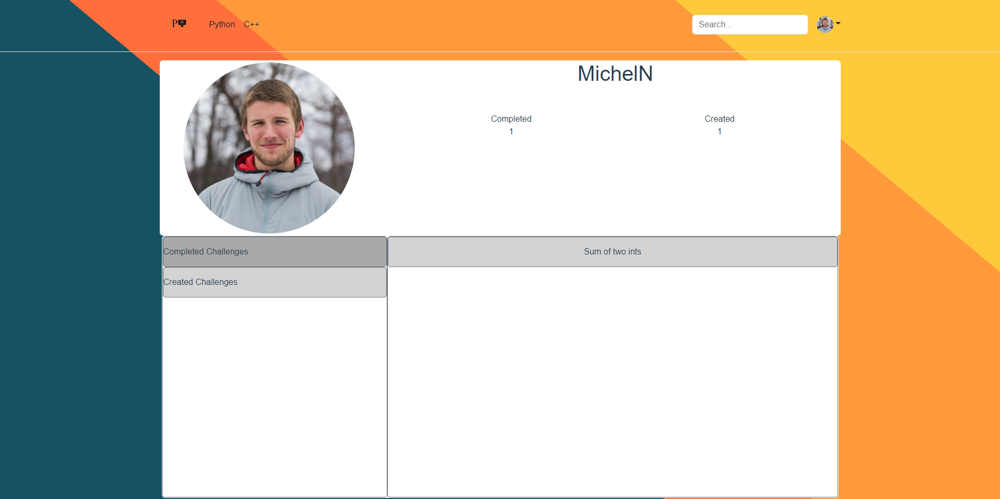
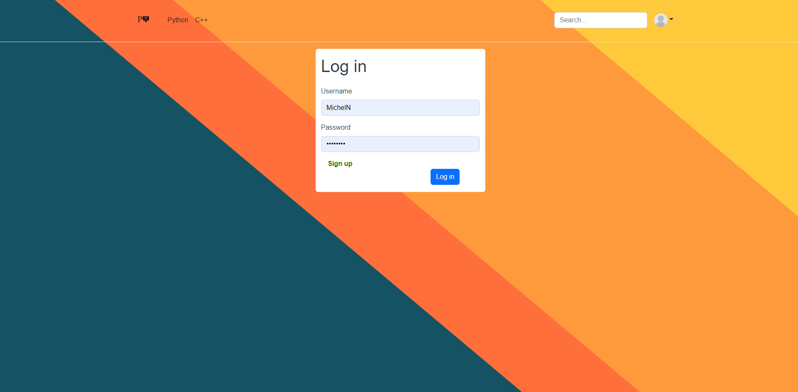
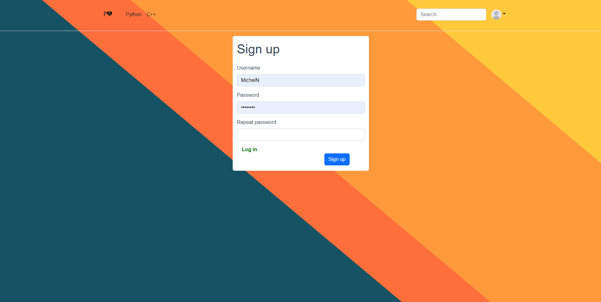

# ProgChamp

ProgChamp is a full-stack coding challenge platform for practicing Python and C++. Users can browse challenges, write code in the browser, check submissions, view solutions, comment, create challenges, and track progress from their profile.



## Features

- Browse all challenges or filter by Python and C++
- View challenge instructions
- Write code in an embedded editor
- Check Python and C++ submissions through the Django backend
- View official solutions
- Comment on solutions
- Sign up, log in, and use token-based authentication
- Track completed and created challenges from the profile page
- Create new challenges
- Dockerized frontend and backend setup

## Screenshots

| Challenge | Solution | Profile |
|---|---|---|
|  |  |  |

| Login | Sign Up | Create Challenge |
|---|---|---|
|  |  |  |

## Tech Stack

Frontend:

- Vue 3
- Vue Router
- Vuex
- Axios
- Bootstrap 5
- Ace editor assets

Backend:

- Python 3.10
- Django 3.2
- Django REST Framework
- Djoser token authentication
- SQLite for local development
- `g++` for C++ code execution

Infrastructure:

- Docker
- Docker Compose

## Project Structure

```text
ProgChamp/
  docker-compose.yml
  Docs/               # Project screenshots
  DjangoProgChamp/    # Django REST API
  vue-progchamp/      # Vue frontend
```

## Run With Docker

Requirements:

- Docker Desktop
- Docker Compose

From the project root:

```bash
docker compose up --build
```

Open the app:

```text
http://127.0.0.1:8080/
```

Backend API:

```text
http://127.0.0.1:8000/
```

The backend container runs migrations and seeds starter Python/C++ challenges automatically.

Seeded development admin:

```text
username: seed_admin
password: admin12345
```

## Local Development

Backend:

```bash
cd DjangoProgChamp
python -m venv .venv
source .venv/bin/activate
pip install -r requirements.txt
python manage.py migrate
python manage.py seed_challenges
python manage.py runserver
```

On Windows, activate the backend virtual environment with:

```powershell
.venv\Scripts\activate
```

Frontend:

```bash
cd vue-progchamp
npm install
npm run serve
```

## Environment Files

Backend example:

```text
DjangoProgChamp/.env.example
```

Frontend example:

```text
vue-progchamp/.env.example
```

Do not commit real `.env` files.

## Repository Hygiene

The repository is set up to ignore generated and local-only files:

- `node_modules/`
- `.venv/`
- `dist/`
- `db.sqlite3`
- `media/`
- `static/`
- `staticfiles/`
- `wheelhouse/`
- `__pycache__/`
- logs
- real `.env` files

## Status

This project is being prepared as a portfolio-ready full-stack app. The current Docker setup is designed for local development.
